# HQ Open Questions

Please answer each **DATA** question with: **file name**, **field name**, and **formula** if the number is calculated.

Answers below are annotated with a status tag and, where known, `file → field` / formula.

When a question is answered: write it into the owning specs and **remove** it from this ledger (same change). Process: [DEVELOPMENT.md § Resolving open questions](../process/DEVELOPMENT.md#resolving-open-questions).

**Sources (not all in git).** CI fixture is [`data/out.rep`](../../data/out.rep). Product dictionary is `npu-compute性能优化.docx` (外发版 0818, Ascend C Toolkit pack). `example.rep` is the same pack (`npu-tools-main-docs/docs/example.rep` when dropped locally; nested `npu-rep`; includes `HardwareInfo.jsonl`). Neither the docx nor `example.rep` is committed.

Design mockups: [`DESIGN_INDEX.md`](../ui/DESIGN_INDEX.md) · one annotated crop per question below · sources [`docs/ui/source/v930/`](../ui/source/v930/) · component crops under `src/ui/**/visual/` ([regenerate](visual/hq/README.md))

**Numbering.** This ledger is **HQ 1–37** (`q1.png`…`q37.png`). It is not the Q1–Q23 space in [OPEN_QUESTIONS.md](OPEN_QUESTIONS.md) — resolved OPEN Q22 (measure aside) is not HQ 22 (UB→L2/GM).

- **INTERIM** — we already ship a rule in [INTERIM_DECISIONS.md](INTERIM_DECISIONS.md); Product can still override.
- **PARTIAL** — field name known, but a value or a product decision is still missing.
- **OPEN** — not derivable from the current docs or sample.

Resolved right-panel mappings (进程 / 算子类型 / Blocks, Task Duration, measured I/O BW, ICache Miss, L2↔L1, NA handling) live in [VIEW_DATA_MAPPING.md](../ui/VIEW_DATA_MAPPING.md) and [OPEN_QUESTIONS.md](OPEN_QUESTIONS.md).

---

## DATA QUESTIONS

DATA = file/field/formula mapping from report data → visualized number/series/edge.

### 整体耗时 (Total duration)

**Design:** [`v930/report-stats-open`](../ui/source/v930/report-stats-open.jpeg) · [`summary-cards.png`](../../src/ui/StatsAside/StatsSummaryPanel/visual/summary-cards.png)

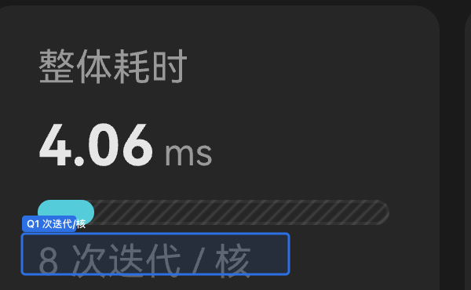

1. The line **N 次迭代 / 核** (N iterations / core) — which field? (Is it `Block Dim`?)
   - **INTERIM** — [I-Q6e](INTERIM_DECISIONS.md) uses `OpBasicInfo.csv` → `Block Dim` ("Task运行切分数量，对应Task运行时核数"). Sample = 8, matching the sketch. "Iterations-per-core" vs "block count" is not explicitly equated by Product.

### 算力情况 (Compute power)

**Design:** [`v930/report-stats-open`](../ui/source/v930/report-stats-open.jpeg) · [`summary-cards.png`](../../src/ui/StatsAside/StatsSummaryPanel/visual/summary-cards.png)

This card is hidden until we have answers.

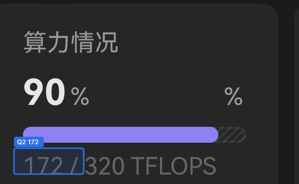

2. **172** (measured TFLOPS) — which file, which field(s), and the formula?
   - **OPEN** — the doc's 算力情况 table is blank. Only raw FLOPS *counts* exist (`ArithmeticUtilization.csv` → `aic_cube_fops`, `aiv_vec_fops`); no TFLOPS formula.

---

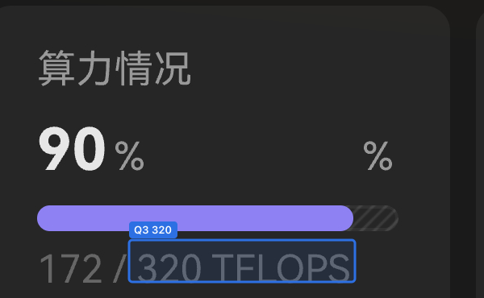

3. **320** (peak TFLOPS) — which file and field? Or a fixed number per chip?
   - **OPEN** — no peak-compute field in any file; not documented.

---

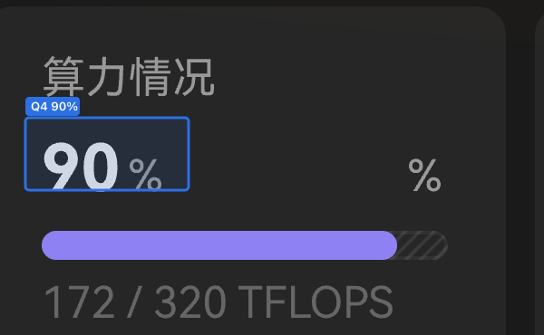

4. **90** (score) — what is the formula? Is it `measured / peak × 100`?
   - **OPEN** — no "score" concept documented.

### 输入带宽 / 输出带宽 (Input / output bandwidth)

**Design:** [`v930/report-stats-open`](../ui/source/v930/report-stats-open.jpeg) · [`summary-cards.png`](../../src/ui/StatsAside/StatsSummaryPanel/visual/summary-cards.png)

On real data, `0.08 / 1.6` is about **5%**, not 81. So the score formula is unclear.

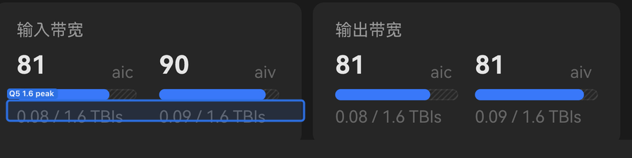

5. **1.6 TB/s** (peak) — which file and field?
   - **OPEN** — no peak-bandwidth field in any file; the doc's 内存负载 "理论值" column is empty for every row.

---

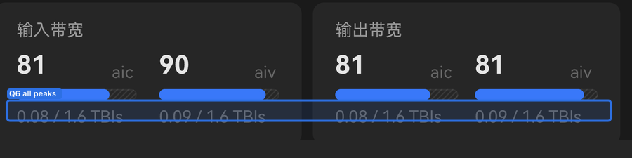

6. Is the peak the same for aic, aiv, input, and output? Yes or no. If no, give each peak.
   - **OPEN** — depends on Q5.

---

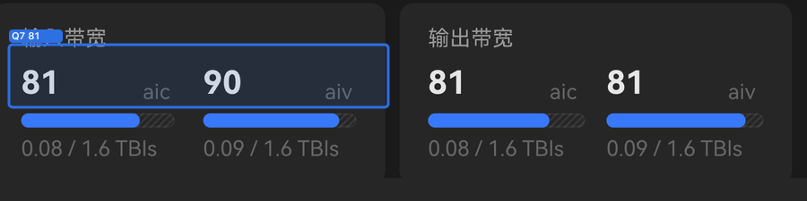

7. **81** (score) — what is the formula? It is not `0.08 / 1.6`.
    - **OPEN** — no "score" concept; the doc maps raw bandwidth values only.

---

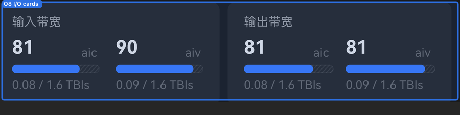

8. Do these cards come from `Report.csv` instead? If yes, list the column names.
    - **OPEN** — the doc names `Report.csv` once ("SOL / 平均带宽") but never lists columns, and it is absent from `example.rep`. Interim I-Q6g uses `Memory.csv`, not `Report.csv`.

### 平均核利用率 (Average core utilization)

**Design:** [`v930/report-stats-open`](../ui/source/v930/report-stats-open.jpeg) · [`summary-cards.png`](../../src/ui/StatsAside/StatsSummaryPanel/visual/summary-cards.png)

This card is hidden until we have answers.

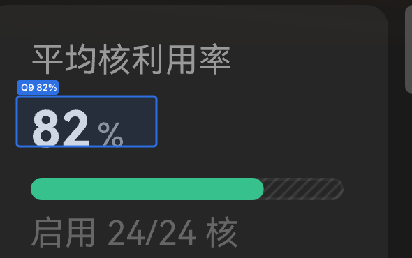

9. **82%** — which file, which field, and the formula?
    - **OPEN** — the doc's 平均核利用率 table is blank; no field or formula.

---

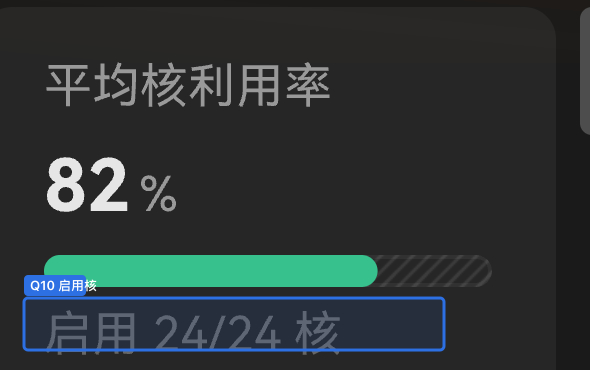

10. **24/24** in **启用 n/m 核** (enabled n/m cores) — which field is *n*? Which field is *m*?
    - **OPEN** — no "enabled cores" field. Sample `ai_core_count` = 36 (not 24); `Block Dim` = 8.

### Roofline 瓶颈分析 (Roofline bottleneck analysis)

**Design:** [`v930/report-stats-open`](../ui/source/v930/report-stats-open.jpeg) · [`roofline.png`](../../src/ui/StatsAside/RooflinePanel/visual/roofline.png)

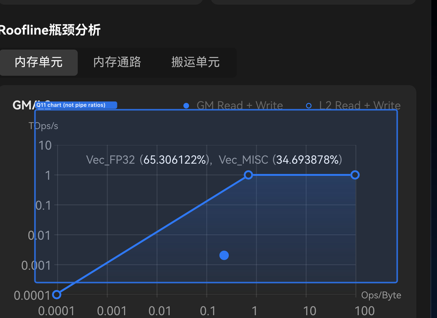

11. The old mapping uses `aic_cube_ratio`, `aic_mte2_ratio`, `aic_mte1_ratio`. Those are pipe busy rates, not chart axes. What should we use instead?
    - **OPEN** — the doc only repeats the old mapping; real Roofline axes are not documented.

---

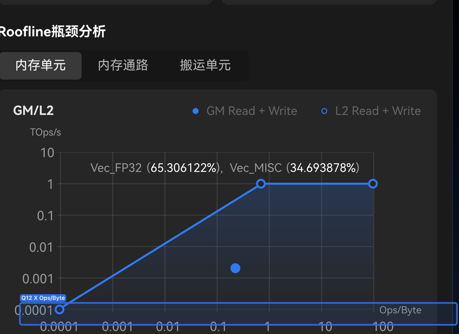

12. **X axis** (Ops/Byte) — which file, fields, and formula? Is GM and L2 the same formula?
    - **OPEN** — no fields/formula.

---

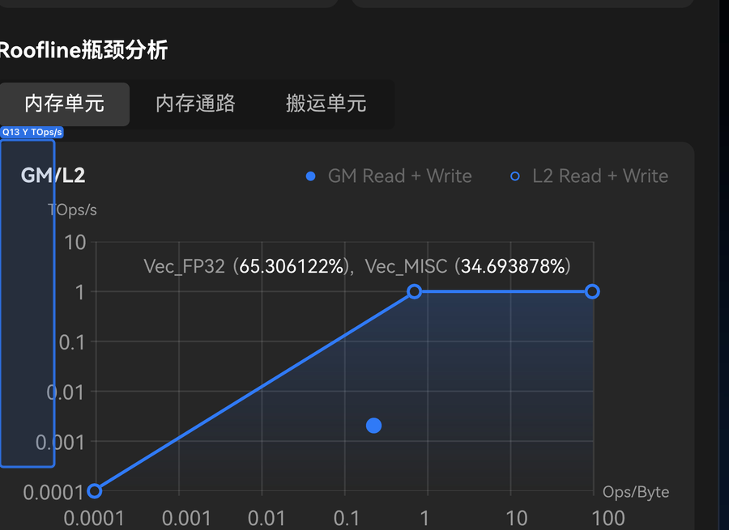

13. **Y axis** (TOps/s) — which file, fields, and formula?
    - **OPEN** — no formula (raw FLOPS counts `aic_cube_fops` / `aiv_vec_fops` exist but are not a TOps/s formula).

---

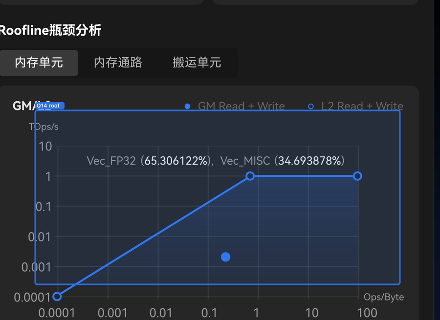

14. The **roof** lines (peak bandwidth and peak compute) — which file and fields?
    - **OPEN** — peak compute and peak bandwidth are documented nowhere.

---

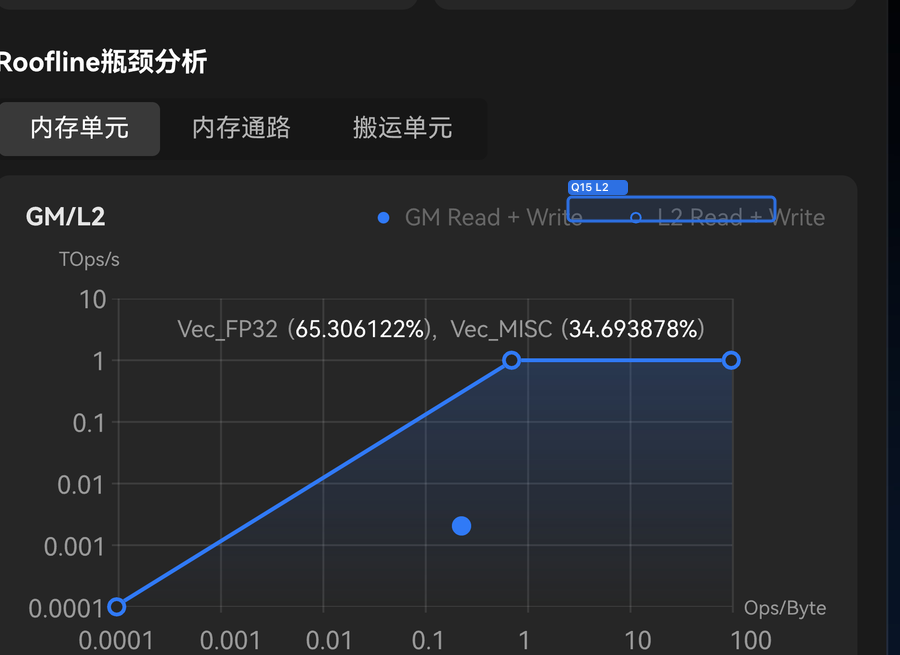

15. The **L2** point on the chart needs bytes moved. Which field has L2 bytes? (`L2Cache.csv` only has hit counts.)
    - **OPEN (premise incomplete)** — correct that there is no *bytes* field in `L2Cache.csv`. But "only has hit counts" is incomplete: the sample also has hit **rates** — `aic_read_hit_rate(%)`, `aic_write_hit_rate(%)`, `aic_total_hit_rate(%)` (+ aiv). Note the doc's L2Cache dictionary (close/far hit/miss/victim) does **not** match the sample (r0/r1 read + write hit/miss + rates).

---

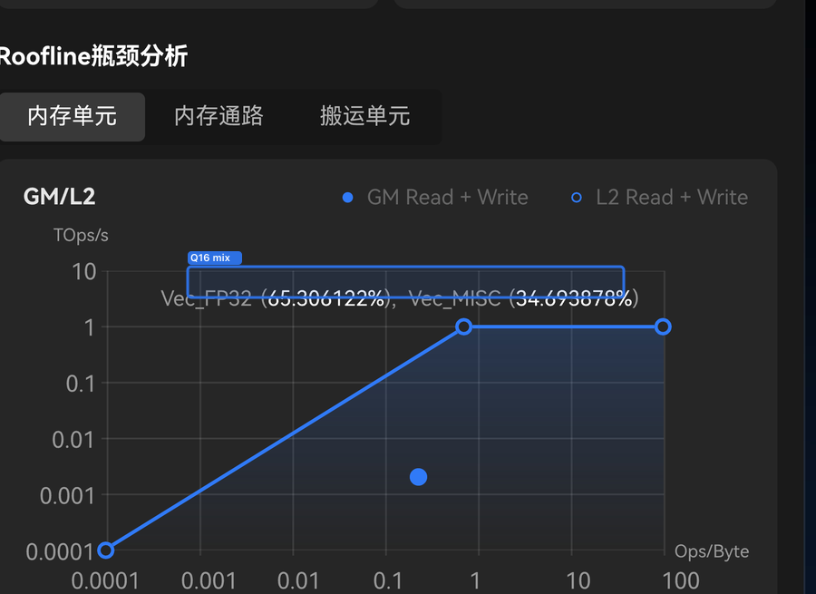

16. Labels like `Vec_FP32` / `Vec_MISC` — which file and fields? Which labels do we show if many are non-zero?
    - **PARTIAL** — fields exist in `ArithmeticUtilization.csv`: `aiv_vec_fp32_ratio`, `aiv_vec_fp16_ratio`, `aiv_vec_int32_ratio`, `aiv_vec_int16_ratio`, `aiv_vec_misc_ratio`. The doc's dictionary uses *different* names (`aiv_vec_vf_ratio`, `aiv_vec_sfu_ratio`, `aiv_vec_simt_vf_ratio`). The "which to show when many are non-zero" rule is undocumented.

---

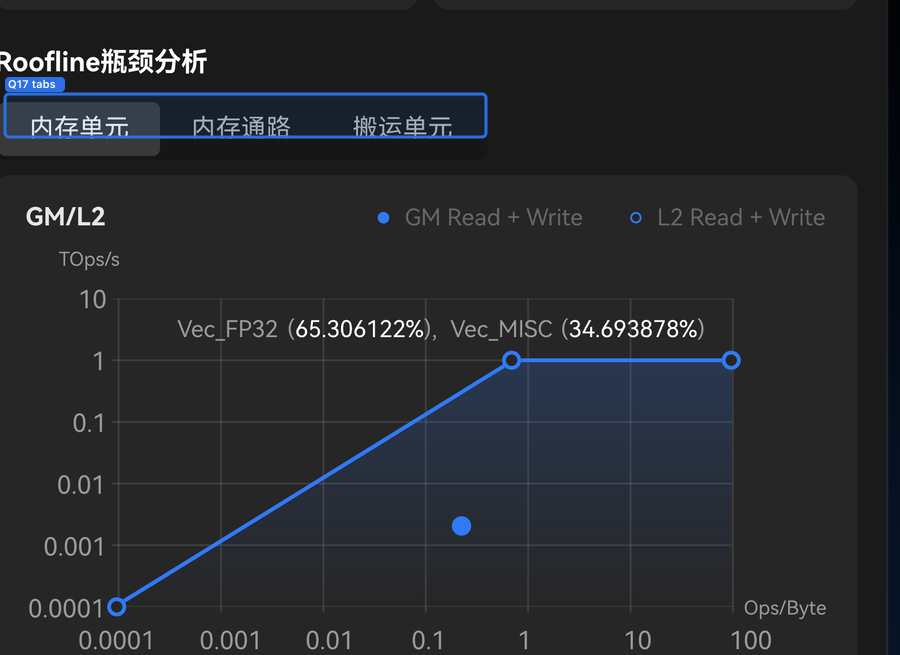

17. Tabs **内存单元** (memory unit), **内存通路** (memory path), **搬运单元** (transfer unit) — what should each tab show?
    - **PARTIAL** — the doc's Roofline table maps 内存单元→`aic_cube_ratio`, 内存通路→`aic_mte2_ratio`, 搬运单元→`aic_mte1_ratio` (all `PipeUtilization.csv`). This is exactly the "pipe busy rate" mapping Q11 flags as wrong.

### PIPE 占用率 / 计算负载分析 (Pipe occupancy / compute load)

**Design:** [`v930/compute-load`](../ui/source/v930/compute-load.jpeg) · [`pipe-bars.png`](../../src/ui/StatsAside/PipeOccupancyPanel/visual/pipe-bars.png) · [`v930/compute-load-detail`](../ui/source/v930/compute-load-detail.jpeg) · [`compute-detail-tabs.png`](../../src/ui/StatsAside/CsvFieldListPanel/visual/compute-detail-tabs.png)

These bars are already on screen. Please confirm.

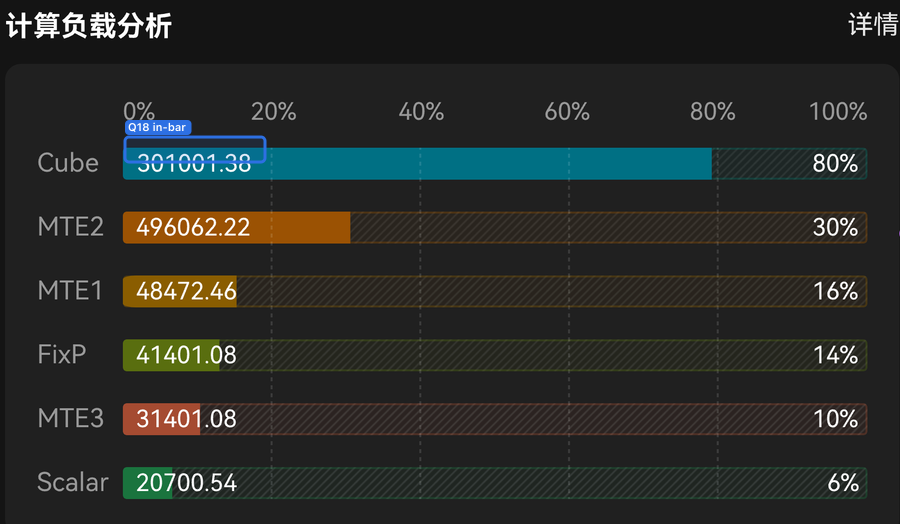

18. The number **inside** the bar (for example `301001.38`) — is it time (`*_time(us)`) or cycles (`*_total_cycles`)?
    - **INTERIM** — [I-Q6f](INTERIM_DECISIONS.md): mean of non-`NA` `*_time(us)` for the same family/side as the ratio; omit when all NA. Not cycles. Sketch `301001.38` does not match `example.rep` magnitudes (fixture mismatch, not a missing mapping). Product can still pick cycles.

---

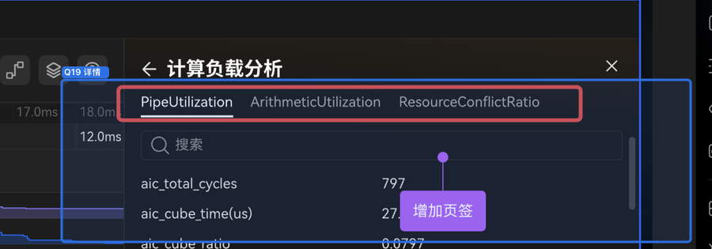

19. On the summary bars, do we average all blocks? On **详情** (Details), do we show only the selected block?
    - **INTERIM** — [I-Q6b](INTERIM_DECISIONS.md): summary PIPE bars = mean of non-`NA` ratios across `block_id`. [I-Q6c](INTERIM_DECISIONS.md): **详情** / memory / metrics = selected block. Overlaps Q28–29. This crop is **详情**; summary mean is Q28.

### 内存负载分析 (Memory load analysis)

**Design:** [`v930/report-stats-scrolled`](../ui/source/v930/report-stats-scrolled.jpeg) · [`memory-topology.png`](../../src/ui/StatsAside/MemoryTopologyPanel/visual/memory-topology.png) · [`buffer-links.png`](../../src/ui/StatsAside/MemoryTopologyPanel/visual/buffer-links.png) · [`v930/memory-load-detail`](../ui/source/v930/memory-load-detail.jpeg)

Bandwidth labels on arrows are already mapped. These are still open.

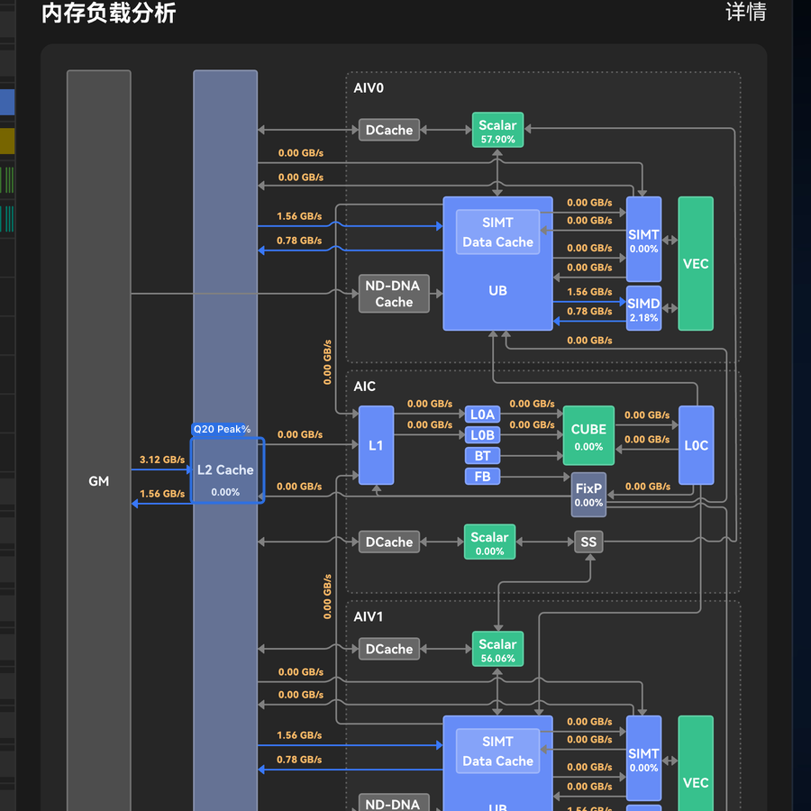

20. **Peak (%)** color on each box — which file and field for each box?

    | Box | File | Field |
    |-----|------|-------|
    | GM | — | no Peak(%) / 理论值. `aic/aiv_main_mem_*_bw` is GM↔L2 *arrow* BW, not a box peak |
    | L2 | — | no Peak(%) field. Do **not** use `aic_l1_*_bw` (that is L1 arrow BW) |
    | L1 | — | no 理论值. `Memory.csv` `aic_l1_read/write_bw` is L2↔L1 *arrow* BW, not a box peak |
    | L0A / L0B / L0C | — | no 理论值. `MemoryL0.csv` `aic_l0a/l0b/l0c_*_bw` is measured arrow BW |
    | Cube | — | `aic_cube_ratio` is pipe occupancy, not Peak(%) unless Product says so |
    | FixP | — | `aic_fixpipe_ratio` is pipe occupancy, not Peak(%) |
    | UB | — | no 理论值. `MemoryUB.csv` `aiv_ub_read/write_bw_*` is measured arrow BW |
    | Vec | — | `aiv_vec_ratio` is pipe occupancy, not Peak(%) |
    | Scalar | — | `aic/aiv_scalar_ratio` is pipe occupancy, not Peak(%) |

    - **PARTIAL** — VIEW_DATA_MAPPING: Peak(%) has no field mapping. The doc's 理论值 column is empty for every row, so the percentage cannot be computed. Measured arrow BW and pipe ratios are not a substitute. Sketch **0.00%** on L2 is the only Peak(%) in this frame.

---

21. **L2Cache Hit Rate** on the GM↔L2 arrow — which field: read, write, or total? Use AIC, AIV, or both?
    - **INTERIM** — adapter uses the first non-`NA` of `aic_total_hit_rate(%)`, `aiv_total_hit_rate(%)`, `aic_read_hit_rate(%)`, `aiv_read_hit_rate(%)`. Product has not picked read/write/total × AIC/AIV. This jpeg prints **GB/s** on those arrows, not a hit %.

---

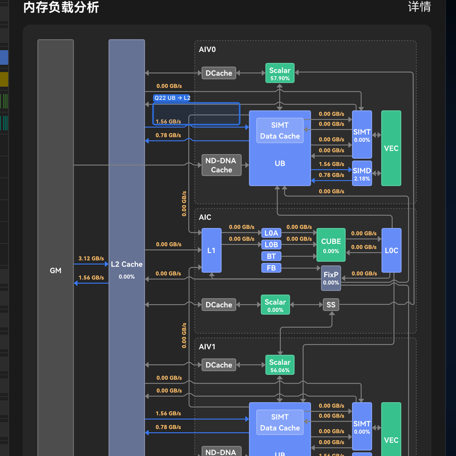

22. **UB → L2/GM** — which file and field? Two names exist:
    - `MemoryUB.csv`: `aiv_ub_read_bw_gm`
    - `Memory.csv`: `aiv_ub_to_gm_bw`
    - **INTERIM** — adapter tries `MemoryUB.csv` → `aiv_ub_read_bw_gm(GB/s)` first, then `Memory.csv` → `aiv_ub_to_gm_bw(GB/s)`. Sample MemoryUB has **no `*_gm` fields** (only `aiv_ub_read/write_bw_vector` and `_scalar`). Product has not unified the names.

---

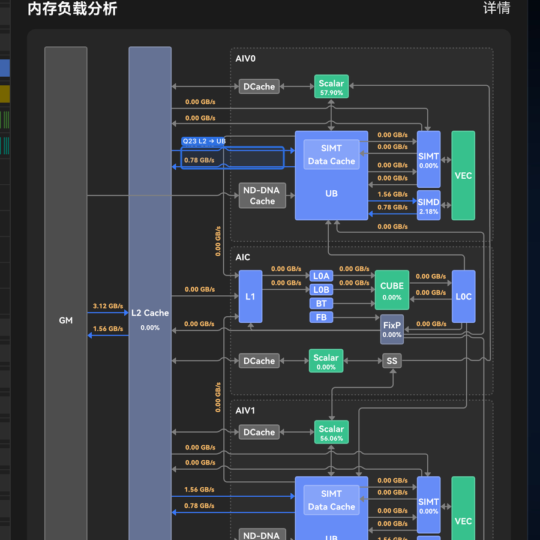

23. **L2/GM → UB** — which file and field?
    - `MemoryUB.csv`: `aiv_ub_write_bw_gm`
    - `Memory.csv`: `aiv_gm_to_ub_bw`
    - **INTERIM** — adapter tries `MemoryUB.csv` → `aiv_ub_write_bw_gm(GB/s)` first, then `Memory.csv` → `aiv_gm_to_ub_bw(GB/s)`. Same sample gap: no gm fields on MemoryUB.

---

24. **L0C → L1** — show it? If yes, which field? (`L0C_to_L1_datas(KB)`?)
    - **INTERIM** — we show `Memory.csv` → `L0C_to_L1_datas(KB)` when present (`L0C_to_L1_bw_usage_rate(%)` is unused). Product 理论值 is still 待确定. Sketch node is **LOC**.

---

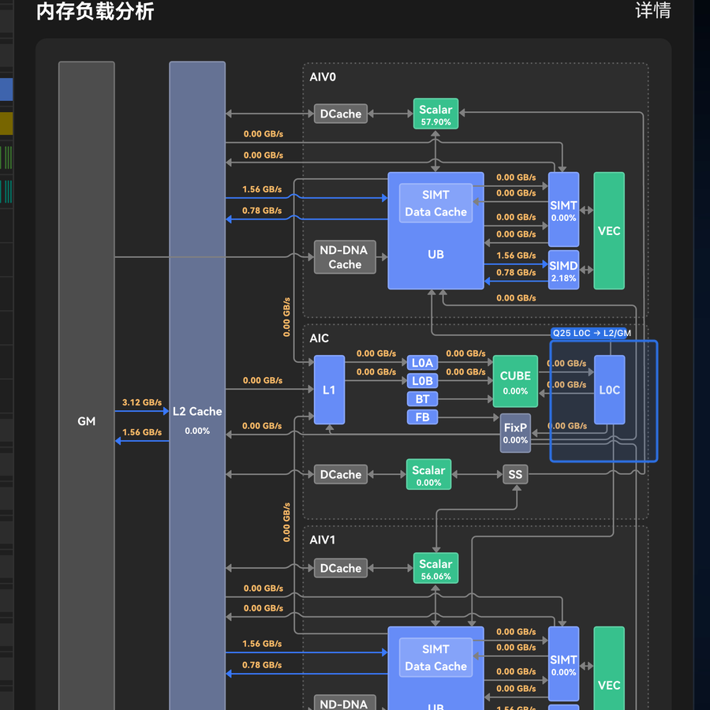

25. **L0C → L2/GM** — show it? If yes, which field? (`L0C_to_GM_datas(KB)`?)
    - **INTERIM** — we show `Memory.csv` → `L0C_to_GM_datas(KB)` when present. Product 理论值 is still 待确定. Same **LOC** node as Q24; this jpeg does not label the three L0C edges separately.

---

26. **L0C → UB** — show it? If yes, which field? (none in the sample)
    - **OPEN** — the doc leaves this blank (待确定); no field exists in sample or doc. Same **LOC** node as Q24–25; no L0C→UB edge is drawn.

---

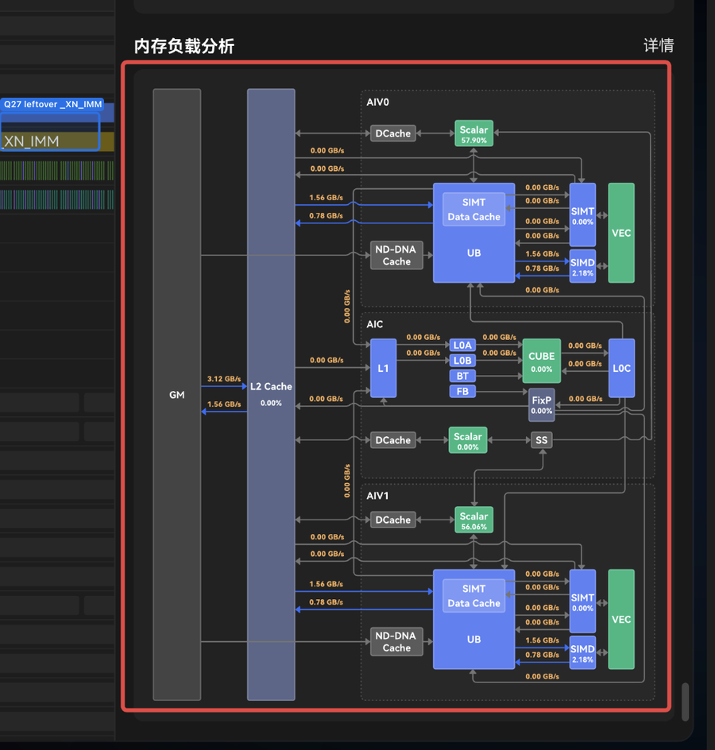

27. Dual-Die / Remote memory — show those arrows? Yes or no. If yes, which fields?
    - **OPEN (mismatch)** — the doc mentions remote memory / close-far access, but the sample `L2Cache.csv` uses `r0`/`r1` (not close/far). No concrete remote-arrow fields. Leftover `_XN_IMM` on the timeline strip is not a topology remote edge.

### Rules that apply everywhere

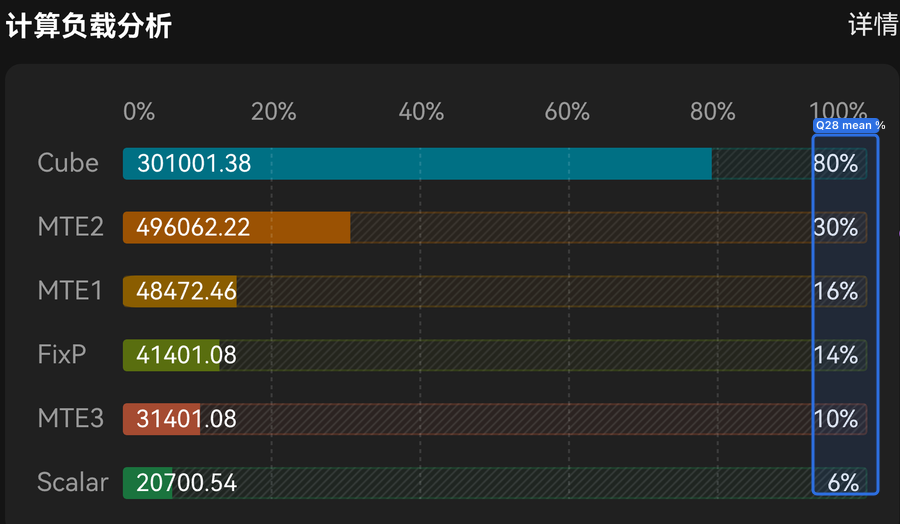

28. A CSV often has many `block_id` rows (the sample has 8). For summary numbers, do we use **mean**, **max**, **first block**, or **the selected block**?
    - **INTERIM** — [I-Q6b](INTERIM_DECISIONS.md): mean of non-`NA` values across `block_id` for summary PIPE / I/O measured BW. Product has not confirmed mean vs max vs selected.

---

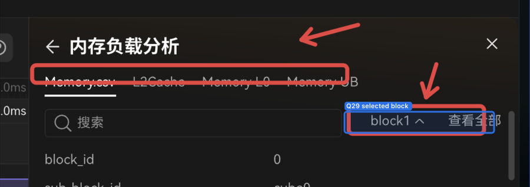

29. Same rule for every widget (cards, PIPE, Roofline, memory diagram)? Yes or no. If no, list the exceptions.
    - **INTERIM** — [I-Q6c](INTERIM_DECISIONS.md): summary PIPE (and I-Q6g measured BW) stay I-Q6b mean-across-blocks; **详情** / memory diagram / metrics lists are the selected block. Roofline interim aggregates like I-Q6b ([I-Q11a](INTERIM_DECISIONS.md)). This crop is the **详情** block switcher (the exception). Summary mean is Q28.

---

## UI/UX QUESTIONS

UI/UX = presentation, missing-input behavior, layout, units, gestures.

### Header

**Design:** [`v930/report-stats-open`](../ui/source/v930/report-stats-open.jpeg) · [`summary-cards.png`](../../src/ui/StatsAside/StatsSummaryPanel/visual/summary-cards.png) · [`v930/hardware-more-detail`](../ui/source/v930/hardware-more-detail.jpeg) · [`hardware-detail.png`](../../src/ui/StatsAside/HardwareDetailsPanel/visual/hardware-detail.png)

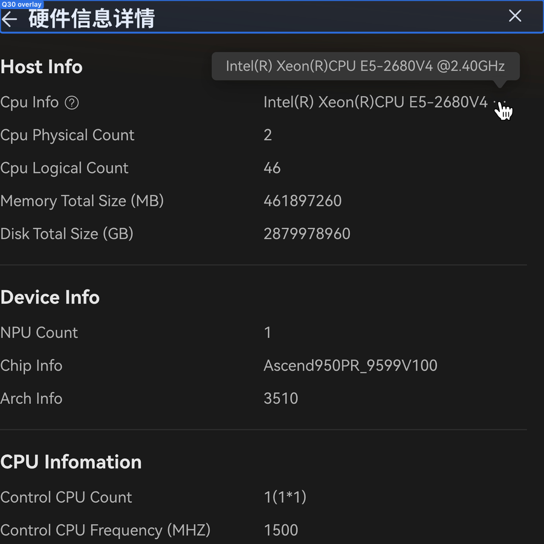

30. Must every report include `HardwareInfo.jsonl`? Yes or no.
   - **OPEN** — the doc shows it is collected during 基础信息采集, but gives no availability guarantee. This overlay is what that file fills.

---

31. If `HardwareInfo.jsonl` is missing, what happens to **更多** (More) / 硬件信息详情 (Hardware details)? Hide it, or show an empty page?
    - **INTERIM** — [I-Q7a](INTERIM_DECISIONS.md): prefer `HardwareInfo.jsonl`; fall back to non-empty `OpBasicInfo.csv` columns; hide the overlay when both are empty. Product can still override.

### 整体耗时 (Total duration)

**Design:** [`v930/report-stats-open`](../ui/source/v930/report-stats-open.jpeg) · [`summary-cards.png`](../../src/ui/StatsAside/StatsSummaryPanel/visual/summary-cards.png)

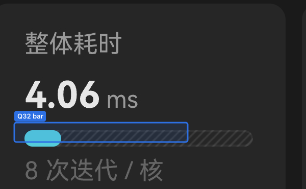

32. The bar — is it only decoration, or a real percent? If a percent: percent of what? Give the field and formula.
    - **INTERIM** — [I-Q6e](INTERIM_DECISIONS.md): decorative (fixed short cyan fill), not a % of peak. Product has not defined a scale.

### 算力情况 (Compute power)

**Design:** [`v930/report-stats-open`](../ui/source/v930/report-stats-open.jpeg) · [`summary-cards.png`](../../src/ui/StatsAside/StatsSummaryPanel/visual/summary-cards.png)

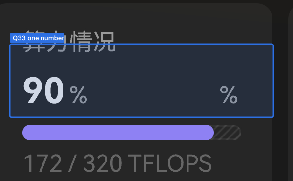

33. One number for the whole op, or two columns (**aic** and **aiv**), like the bandwidth cards?
    - **OPEN** — no display rule documented.

### 输入带宽 / 输出带宽 (Input / output bandwidth)

**Design:** [`v930/report-stats-open`](../ui/source/v930/report-stats-open.jpeg) · [`summary-cards.png`](../../src/ui/StatsAside/StatsSummaryPanel/visual/summary-cards.png)

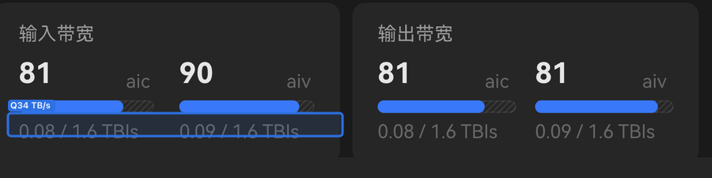

34. If the measured value is small (for example `15.8 GB/s`), show **GB/s** or **TB/s**?
    - **OPEN** — UX decision.

### 内存负载分析 (Memory load analysis)

**Design:** [`v930/report-stats-scrolled`](../ui/source/v930/report-stats-scrolled.jpeg) · [`memory-topology.png`](../../src/ui/StatsAside/MemoryTopologyPanel/visual/memory-topology.png) · [`buffer-links.png`](../../src/ui/StatsAside/MemoryTopologyPanel/visual/buffer-links.png)

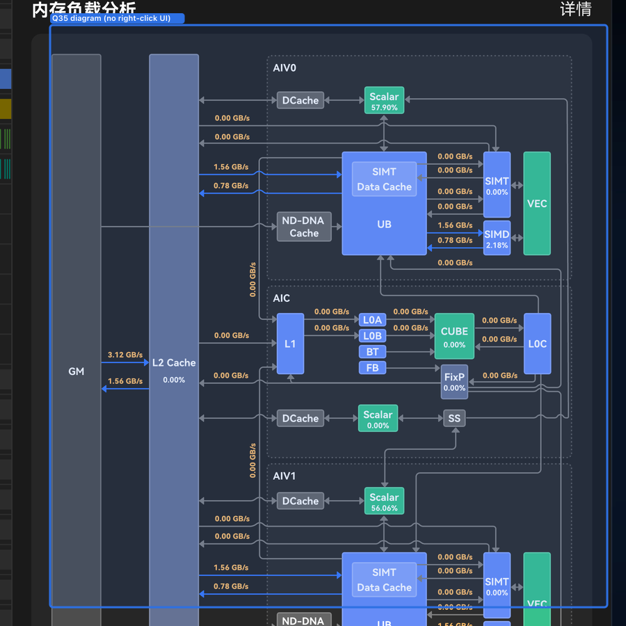

35. Right-click on the memory diagram — extra details? Yes or no. If yes, which fields?
    - **OPEN** — the doc only asks "是否有右击的详情" without specifying fields. No right-click UI in this mockup.

---

36. Some labels are **KB**, some are **GB/s**. Keep both, or convert to one unit?
    - **OPEN** — unit/UX decision. This frame only has **GB/s**; KB would be L0C datas (`L0C_to_L1_datas(KB)`).

### PIPE 占用率 / 计算负载分析 (Pipe occupancy / compute load)

**Design:** [`v930/search-highlight`](../ui/source/v930/search-highlight.jpeg) · [`v930/compute-load-detail`](../ui/source/v930/compute-load-detail.jpeg) · [`compute-detail-tabs.png`](../../src/ui/StatsAside/CsvFieldListPanel/visual/compute-detail-tabs.png)

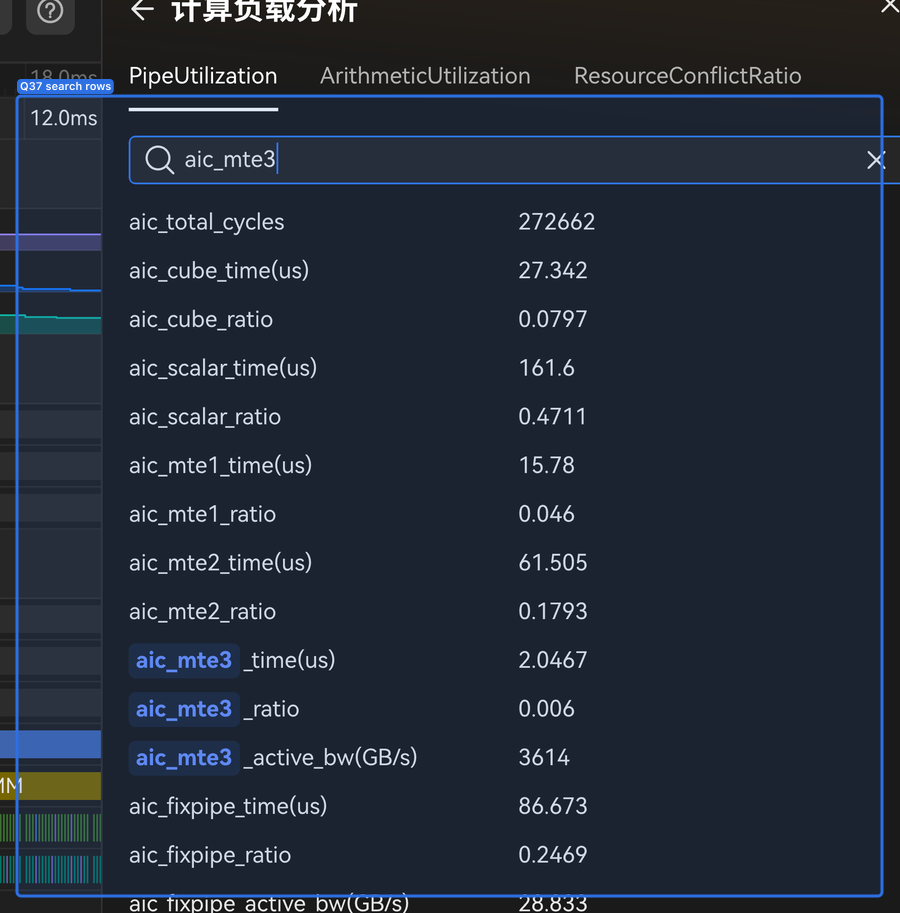

37. CSV **详情** (details) search currently **highlights** matching header substrings (navy chip on `aic_mte3`) and keeps every row. Should it also **filter** — hide non-matching rows? Highlight only, filter only, or both? Same rule for compute and memory overlays?
    - **OPEN** — we shipped highlight-only ([PR #32](https://github.com/IdeFrontend/profiling-report/pull/32)) to match this sketch. [UX_SPEC](../ui/UX_SPEC.md) still says the pipe field list filters rows. Product has not picked.
