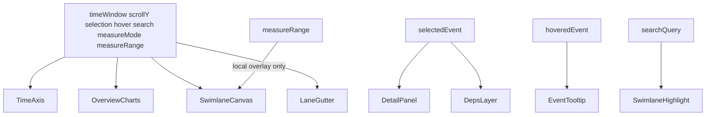

# UX Specification — Profiling Report

Complete user-experience specification for the Ascend OP profiling report viewer (`report.ncrep` / `.rep`), derived from design sketches in this folder.

**Related appendices**

| Doc | Role |
|-----|------|
| [DOMAIN_AND_USERS.md](../context/DOMAIN_AND_USERS.md) | Who the user is, pain points, glossary |
| [VIEW_DATA_REQUIREMENTS.md](../formats/VIEW_DATA_REQUIREMENTS.md) | Required inputs per chart/view; hide rules |
| [COLOR_TOKENS.md](COLOR_TOKENS.md) | Normative sketch colors |
| [UI_OVERVIEW.md](UI_OVERVIEW.md) | Layout regions |
| [INTERACTIONS.md](INTERACTIONS.md) | Low-level gestures and pointer rules |
| [FEATURE_MATRIX.md](FEATURE_MATRIX.md) | MVP vs Phase 2+ feature checklist |
| [COMPONENTS.md](../architecture/COMPONENTS.md) | Vue component and model names |

Sketch filenames below are relative to `docs/ui/`.

**Legend:** **M** = MVP · **P2** = Phase 2+

---

## 1. Purpose and scope

### User

Operator (OP) developer tuning Ascend / CANN kernels inside **MSTT** (and later similar Vue hosts). Goal: understand where time goes on AI Core pipes, whether utilization is balanced, and which intervals dominate latency. Full domain narrative, pain points, and glossary: [DOMAIN_AND_USERS.md](../context/DOMAIN_AND_USERS.md).

### In scope

- Library **Timeline** report shell opened on `.ncrep` / `.rep`
- Right-side analytics modes shown in sketches (stats, PIPE, memory, hardware)
- Selection / hover / zoom behaviors that coordinate multiple panes

### Out of scope (host or other products)

- MSTT performance explorer tree and “add visualization” flows (context only — `source/v930/entry.jpeg`)
- MindStudio Insight `.bin` operator Source/Cache graphs
- System-level Insight (training/cluster) timelines

### Phasing

- **MVP:** Timeline experience end-to-end (overview + swimlane + summary/PIPE + hover/select).
- **P2:** Secondary tabs (OP算子 / 源码 / 详情 / 缓存), roofline, memory topology, hardware aside, deps, multiselect, context menu.

Fidelity of lane content depends on trace richness. Product **target** is sketch-like multi-core lanes ([OPEN_QUESTIONS](../context/OPEN_QUESTIONS.md) Q4); sample fixture may be thinner. UX still applies; empty or thinner data **hides** optional surfaces ([VIEW_DATA_REQUIREMENTS](../formats/VIEW_DATA_REQUIREMENTS.md)).

---

## 2. Usage scenarios

### S1 — Open report and get overview (M)

| | |
|--|--|
| **Goal** | See total time, high-level util, PIPE occupancy, and a readable timeline at a glance |
| **Trigger** | User opens `report.ncrep` / `.rep` from MSTT results |
| **Steps** | 1) Host opens panel 2) Library loads models 3) Timeline tab active 4) Aside shows summary + PIPE 5) Swimlane + overview charts fill main pane |
| **Success** | User can answer “how long?” and “which pipes dominate?” without clicking events |
| **Sketches** | `source/v930/entry.jpeg`, `source/v930/entry.jpeg`, `source/v930/entry.jpeg` |

### S2 — Find busy / idle regions on the timeline (M)

| | |
|--|--|
| **Goal** | Locate dense activity vs gaps across lanes |
| **Trigger** | After S1; user zooms/pans |
| **Steps** | Zoom around interest; pan; optionally expand gutter groups; scan colored blocks and idle gaps |
| **Success** | User identifies a time window and lanes worth inspecting |
| **Sketches** | `source/v930/entry.jpeg`, `source/v930/entry.jpeg` |

### S3 — Inspect one event (M)

| | |
|--|--|
| **Goal** | Learn name and timing of a specific interval |
| **Trigger** | Pointer over / click on a swimlane block |
| **Steps** | Hover → tooltip; click → selection + detail strip; click empty → clear |
| **Success** | User has name, start, duration, end without leaving Timeline |
| **Sketches** | `source/v930/search-highlight.jpeg`, `source/v930/entry.jpeg`, `source/v930/entry.jpeg` |

### S4 — Compare utilization across cores / lanes (M)

| | |
|--|--|
| **Goal** | Spot imbalanced cores or pipes |
| **Trigger** | Viewing gutter util bars and PIPE aside |
| **Steps** | Read % bars in gutter; compare PIPE ranking in aside; expand a core to see child pipes |
| **Success** | User can point to hottest / coldest lanes |
| **Sketches** | Util bars in `source/v930/entry.jpeg`, `source/v930/entry.jpeg`, `source/v930/entry.jpeg` |

### S5 — Drill into PIPE / compute / memory metrics (M1)

| | |
|--|--|
| **Goal** | Rank pipes and inspect raw CSV counters for a selected block |
| **Trigger** | After S1; user needs more than bar chart |
| **Steps** | Read PIPE bars; if MIX, toggle Cube \| Vector; open compute detail tabs (PipeUtilization / ArithmeticUtilization / ResourceConflictRatio); open memory tabs + block switcher; optionally 查看全部 |
| **Success** | User ranks pipes and inspects raw fields without invented formulas |
| **Sketches** | Bars: [`v930/compute-load`](./source/v930/compute-load.jpeg). Details: [`v930/compute-load-detail`](./source/v930/compute-load-detail.jpeg), [`v930/memory-load-detail`](./source/v930/memory-load-detail.jpeg) |
| **Components** | `PipeOccupancyPanel`; `CsvFieldListPanel` — see [COMPONENTS](../architecture/COMPONENTS.md) |

### S6 — Analyze memory paths (M2)

| | |
|--|--|
| **Goal** | Understand bandwidth / path load across L1/L2/UB/GM |
| **Trigger** | After S1; topology is on the stacked 报告统计 scroll |
| **Steps** | View topology under PIPE; 详情 opens memory CSV field list; correlate with timeline window |
| **Success** | User identifies memory-bound paths |
| **Sketches** | `source/v930/memory-load-detail.jpeg`, `source/v930/memory-load-detail.jpeg` |

### S7 — Review hardware context (P2)

| | |
|--|--|
| **Goal** | Confirm device / host / HBM context for the run |
| **Trigger** | “更多” on summary or hardware aside mode |
| **Steps** | Open hardware details; read chip / core / memory inventory |
| **Success** | User knows which NPU configuration produced the report |
| **Sketches** | `source/v930/hardware-more-detail.jpeg`, `source/v930/entry.jpeg` annotations |
| **Depends** | **Out of MVP** until further specs ([Q7](../context/OPEN_QUESTIONS.md)) |

### S8 — Follow dependencies / multi-select (P2)

| | |
|--|--|
| **Goal** | Understand causal links or aggregate a time slice |
| **Trigger** | Select event with deps enabled; or rubber-band / multi-select |
| **Steps** | Toggle dep links; select event → dependency mini-graph; multi-select → summary table; context menu pin |
| **Success** | User sees predecessors/successors or slice aggregates |
| **Sketches** | `source/v930/entry.jpeg`, `source/v930/entry.jpeg`, `source/v930/entry.jpeg` |

### S9 — Switch analysis mode via secondary tabs (P2)

| | |
|--|--|
| **Goal** | Move between Timeline and OP / Source / Details / Cache modes |
| **Trigger** | Click secondary tab |
| **Steps** | Preserve report identity; load tab-specific surface; Timeline state retained when returning |
| **Success** | User can leave Timeline and return without re-opening the file |
| **Sketches** | Tab chrome in `source/v930/entry.jpeg`, `source/v930/entry.jpeg`, etc. |

---

## 3. Information architecture

### Host chrome (not library)

- Editor tab title: `report.ncrep` (sometimes beside `trace.json`)
- Explorer: performance tuning / anomaly folders (`source/v930/entry.jpeg`) — **host**

### Library chrome

| Element | MVP | Notes |
|---------|-----|-------|
| Secondary tabs: OP算子 / **时间线** / 源码 / 详情 / 缓存 | Timeline only | Others P2 |
| Toolbar | Search, zoom, toggle aside | Extra icons P2 |
| Main Timeline layout | Gutter + overview + swimlane + aside + detail | See UI_OVERVIEW |

### Timeline regions → components

| Region | Component(s) |
|--------|----------------|
| Toolbar | `ReportToolbar` |
| Gutter | `LaneGutter` |
| Overview charts | `OverviewCharts` |
| Time axis | `TimeAxis` |
| Swimlane | `SwimlaneCanvas` |
| Aside stats / PIPE | `StatsSummaryPanel`, `PipeOccupancyPanel` |
| Aside hardware / memory / pipe list | P2 panels |
| Detail | `DetailPanel` (MVP); richer bottom dock P2 |
| Tooltip | `EventTooltip` |

---

## 4. Surface catalog — static vs interactive

Interactivity classes:

- **static** — display only for MVP
- **semi** — updates with shared state (time/scroll) but limited or no direct editing
- **interactive** — primary pointer/keyboard targets

| Surface | Class | Inputs | Updates / linked views | Phase |
|---------|-------|--------|------------------------|-------|
| Summary cards (time, compute, BW, util) | static (MVP) | —; P2: “更多” click | P2 → hardware aside | M / P2 |
| PIPE occupancy bars | static (MVP) | —; P2 optional: click → focus lanes | Display only MVP | M |
| Roofline chart | interactive | Hover points; tab filters | Tooltip on points | P2 |
| Overview Cube/Vector charts | semi | Follow time window; P2 brush | Aligned with swimlane/axis | M (brush P2) |
| Time axis + playhead | interactive | Click/drag playhead; pan zone | `timeWindow` / playhead | M |
| Swimlane event blocks | interactive | Hover, click, pan, zoom | Tooltip, selection, detail | M |
| Lane gutter | interactive | Expand/collapse; wheel scroll sync | Row set + `scrollY` | M |
| Event tooltip | interactive (transient) | Hover | Shows timing | M |
| Detail strip / bottom dock | interactive (selection-driven) | Cleared by empty click | Bound to selection | M / richer P2 |
| Pipe field list + search | interactive | Type filter, scroll | Filtered rows | P2 (sketch shows search) |
| Memory topology | semi / interactive | Pan/zoom diagram optional; click nodes P2 | Field highlight | P2 |
| Memory/pipe raw details | interactive | Scroll, search | — | P2 |
| Hardware details | static / semi | Scroll | — | P2 |
| Dependency link curves | interactive | Toggle visibility; click link | Selection / detail | P2 |
| Context menu | interactive | Right-click | Pin / actions | P2 |
| Multi-select summary table | interactive | Shift/Ctrl or rubber-band | Aggregate table | P2 |
| Display control (units / cycles) | interactive | Dialog controls | Axis unit labels | P2 |
| Secondary tabs | interactive | Click tab | Swap main surface | P2 |

---

## 5. Cross-view coordination (sync model)

Shared state aligns with `SwimlaneViewState` + selection/hover ([COMPONENTS.md](../architecture/COMPONENTS.md)):

### Sync rules

1. **Time window** — Zoom/pan updates `timeWindow`. `TimeAxis`, `OverviewCharts`, and `SwimlaneCanvas` always share the same window.
2. **Vertical scroll** — Wheel over swimlane/gutter updates `scrollY`; gutter labels and lanes stay row-aligned.
3. **Hover** — Sets `hoveredEventId` only. Does **not** change selection, detail strip, or aside content.
4. **Selection** — Click event sets `selectedEventId`, fills `DetailPanel`, may dim non-selected events. Empty click clears selection and detail. P2: drives dependency graph and link emphasis.
5. **Search** — Highlights or filters matching event names. Does not clear selection on MVP. P2: Enter jumps to next match (may move time window).
6. **Aside mode** — Switching summary ↔ PIPE ↔ compute details ↔ memory **preserves** timeline view state and selection.
7. **Lane expand/collapse** — Changes visible row set only; does not reset `timeWindow`.
8. **Playhead** — Visual marker; MVP may track click position or view center. Does not by itself change selection.
9. **Tab switch (P2)** — Leaving Timeline keeps serialized view state for restore when returning.
10. **Time-range measure (M2)** — `measureMode` / `measureRange` drive the swimlane overlay only. **Does not** change `timeWindow`. **Does not** recompute the aside or other views (cards, PIPE, details, memory, Roofline).
11. **Hover gap measure (default mode)** — hovering the free gap between adjacent events renders a transient, non-interactive Δt overlay only. **Does not** change `timeWindow`, selection, hover, or any other view; hidden while panning and in measure mode.

---

## 6. Interaction flows

Gesture primitives: [INTERACTIONS.md](INTERACTIONS.md).

### Flow S1 (M)

1. Host opens `.rep` / `.ncrep` → `ProfilingReport` loads.
2. On success: Timeline visible; aside = summary + PIPE; overview charts shown if `OverviewSeries` present else hidden.
3. User reads summary without further input.

### Flow S2 (M)

1. User Ctrl/Cmd+wheel or uses zoom slider → `timeWindow` shrinks/expands around cursor/center.
2. User pans (drag) → window slides; charts/axis/swimlane move together.
3. User expands a core in gutter → child pipe lanes appear.

### Flow S3 (M)

1. Pointer enters event → tooltip with name/start/dur/end (`source/v930/task-hover.jpeg`).
2. Click → selection styling + `DetailPanel` (`source/v930/entry.jpeg`).
3. Click background → clear selection and strip.

### Flow S4 (M)

1. User scans gutter % bars and PIPE aside ranking.
2. Optionally expands hottest core for pipe children.

### Flow S5 (M/P2)

1. MVP: read PIPE bars in aside.
2. P2: open pipe details list; type filter (e.g. `aic_mte3`); inspect values (`source/v930/compute-load.jpeg`).

### Flow S6–S9 (P2)

- **S6:** Aside → memory topology (static SVG + data-driven labels, [Q12](../context/OPEN_QUESTIONS.md)) → optional details list.
- **S7:** Deferred — hardware aside **out of MVP** ([Q7](../context/OPEN_QUESTIONS.md)).
- **S8:** Enable dep links → select event → mini-graph; or multi-select → table; right-click → pin (`source/v930/entry.jpeg`, `source/v930/entry.jpeg`).
- **S9:** Click 源码 / 详情 / 缓存 / OP算子 → different main surface; return to 时间线 restores view state.

---

## 7. Feedback, empty, and error UX

| Condition | UX |
|-----------|-----|
| No `OverviewSeries` | Hide `OverviewCharts` ([Q5](../context/OPEN_QUESTIONS.md)) |
| Optional CSV / panel inputs missing | Hide related surface ([VIEW_DATA_REQUIREMENTS](../formats/VIEW_DATA_REQUIREMENTS.md)); Timeline still works if trace present |
| Summary formula unknown (Q6) | **Interim [I-Q6a](../context/INTERIM_DECISIONS.md):** duration only for OpBasicInfo; **[I-Q6g](../context/INTERIM_DECISIONS.md)** I/O BW cards; hide compute / avg-util |
| Trace missing / invalid | Error state on root; emit `error`; do not show broken swimlane |
| All AIC fields `NA` (vector-only) | Show AIV-derived PIPE; do not invent Cube series |
| Search no matches | Neutral empty hint in toolbar/results; swimlane unchanged except clear highlights |
| Loading | Progress/placeholder in panel until `ready` |

---

## 8. Accessibility and density

- **DOM:** gutter labels, toolbar, aside panels, tooltips, detail strip — keyboard-focusable where practical.
- **Canvas/WebGL:** interval glyphs only; not the sole carrier of text.
- **MVP input:** mouse + wheel + toolbar. Full shortcut parity with PyPTO (W/S/A/D) is P2 ([Q19](../context/OPEN_QUESTIONS.md)).
- **Density:** support zoom from full-trace overview to ns-scale intervals; labels appear when block width allows (FEATURE_MATRIX).

---

## 9. Traceability

| Scenario / surface | FEATURE_MATRIX (examples) | Components | Sketches |
|--------------------|---------------------------|------------|----------|
| S1 overview | Report summary, PIPE bars, Timeline tab | `ProfilingReport`, `StatsSummaryPanel`, `PipeOccupancyPanel` | `v930/entry`, `v930/report-stats-open` |
| S2 navigate | Zoom/pan, time axis | `ReportToolbar`, `TimeAxis`, `SwimlaneCanvas` | `swimlane`, `general` |
| S3 inspect | Hover tooltip, single select, detail | `EventTooltip`, `DetailPanel` | `v930/task-hover`, `v930/detail-strip-raised` |
| S4 util compare | Lane gutter util bars, PIPE | `LaneGutter`, `PipeOccupancyPanel` | overview sketches |
| S5 pipe drill | PIPE bars; pipe field list P2 | `PipeOccupancyPanel`, pipe details P2 | `pipe_*` |
| S6 memory | Memory topology P2 | `MemoryTopologyPanel` | `memory_*` |
| S7 hardware | Hardware details P2 | `HardwareDetailsPanel` | `sidebar_details` |
| S8 deps / multi | Deps, multiselect, context menu P2 | `SwimlaneCanvas` (dep curves in renderer), etc. | `swimlane_selection`, `_multiselect`, `_context_menu` |
| S9 tabs | Secondary tabs P2 | Host or future tab strip | tab chrome in overviews |
| Overview charts | Cube/Vector charts | `OverviewCharts` | `v930/entry`, `v930/report-stats-open` |
| Roofline | Roofline P2 | `RooflinePanel` | `v930/entry`, `v930/report-stats-open` |

---

## 10. Open UX dependencies

| Topic | Question | UX impact until resolved |
|-------|----------|---------------------------|
| Trace richness | Q4, Q8 | Lane taxonomy may be thinner than sketches; hierarchy collapses to available threads |
| Overview series | Q5 | Charts hidden if no series |
| Summary formulas | Q6 / [I-Q6a](../context/INTERIM_DECISIONS.md) / [I-Q6g](../context/INTERIM_DECISIONS.md) | Duration + guessed I/O BW; compute / avg-util hidden |
| Hardware aside | Q7 | S7 blocked |
| Dependencies | Q9 | S8 dep flows blocked |
| Gestures | Q19 | MVP uses wheel/slider only |
