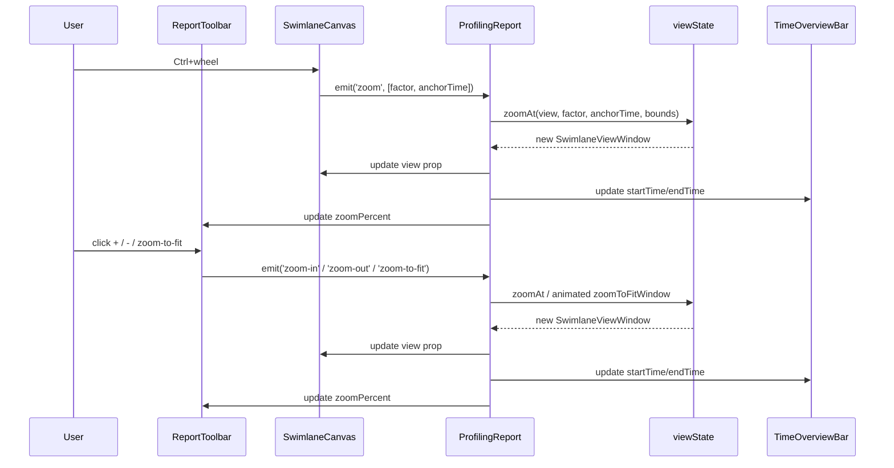
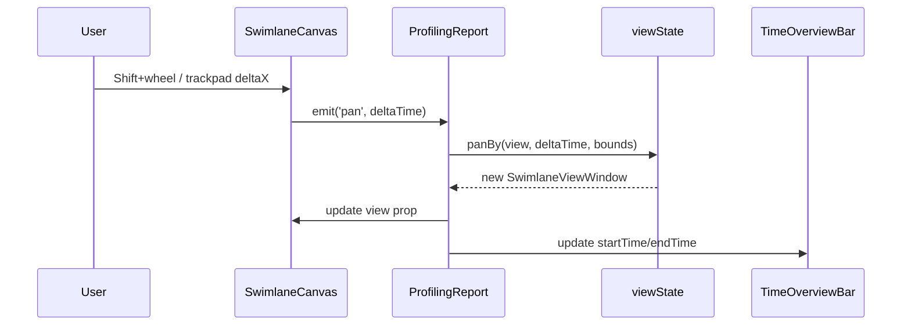
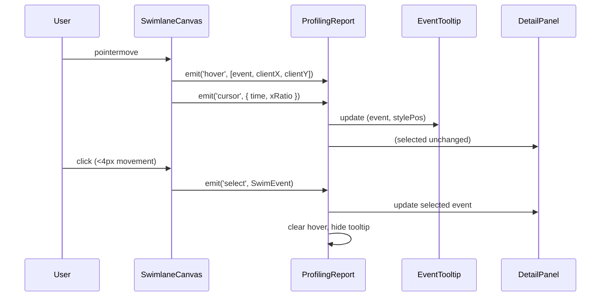
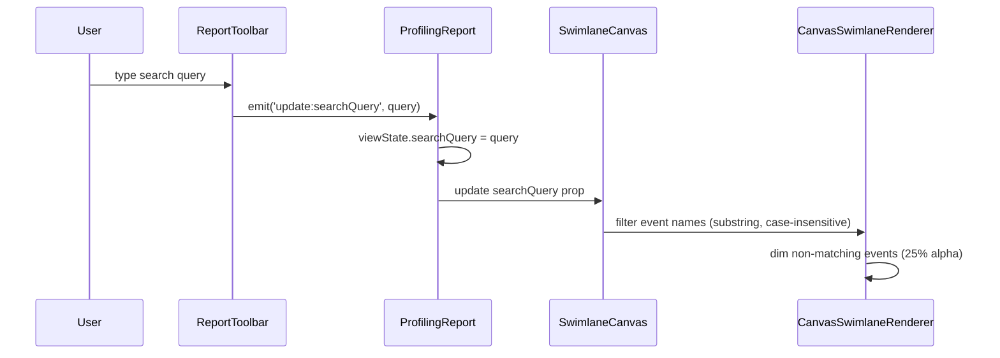
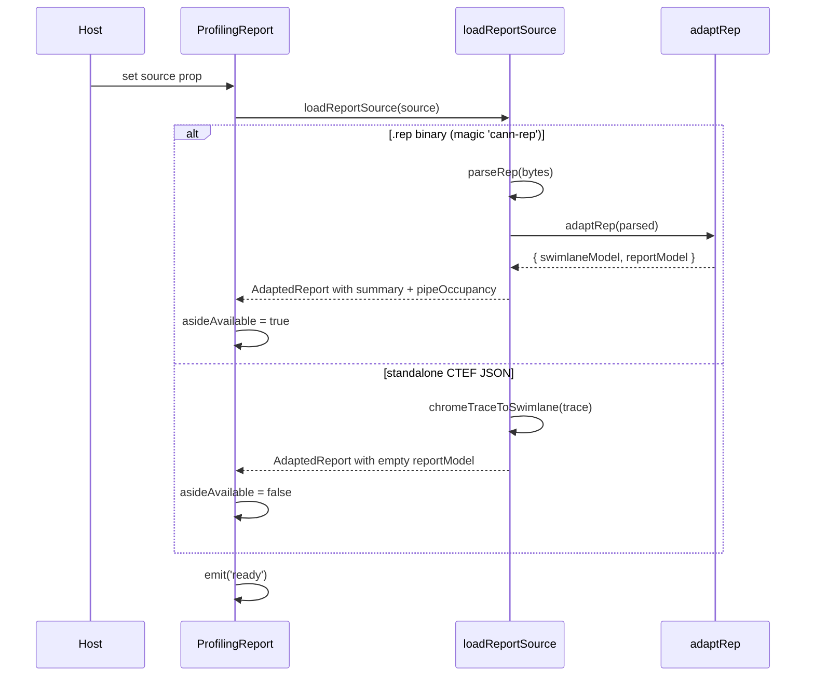

# ProfilingReport

| spec-id-prefix |
|----------------|
| PR-ROOT-*      |

Root component and single owner of all interaction state. Orchestrates data loading, viewport management, and event coordination across child components.

## Inputs

The component works in two modes. In **auto-loading mode**, provide **source** — a binary buffer containing a `.rep` file or standalone CTEF JSON. The component detects, parses, and renders automatically. In **host-managed mode**, provide pre-parsed **swimlaneModel** and **reportModel** to skip the internal pipeline. **title** sets the panel header. **theme** and **locale** control presentation. **timeUnit** (ms/µs/ns) selects the display unit. **dependencyMode** (`all` / `predecessors` / `successors`) and **dependencyDepth** (hops; default `1`, `-1` no hop cap, 10 000 links per side) filter selection curves, undimmed neighbors, and the detail dock's Relevent column alike; the dock's Relevent toolbar updates them in place (no page reload). **capabilities** gates Phase 2 features — an array of feature flag strings such as `'roofline'`, `'memoryDiagram'`, or `'dependencies'`. It is optional in auto-loading mode: the adapter derives capabilities from the source it just parsed and those apply on their own, so a host that passes only `source` still gets the panels its report can fill. A supplied array overrides them wholesale (host-managed mode has no adapter to ask). Adapter-derived flags never outlive their report: they are dropped when `source` is cleared, and they are ignored entirely once the host drives `swimlaneModel` / `reportModel`, which publish an empty capability set unless the host passes its own array.

## Outputs

Lifecycle events: **ready** fires once the report is loaded and the timeline is rendered. **select** fires with a `SelectedEvent` (id, name, startTime, duration, endTime) when the user clicks an event on the swimlane, or `null` when they click empty space. **error** fires with `{ message, cause? }` on load or parse failure. **open-hardware-details** is forwarded from StatsAside when the user clicks 更多 (aside also opens interim HardwareDetailsPanel when data exists, I-Q7a). **open-pipe-details** is forwarded when the user clicks PIPE 详情 (aside navigates to CSV details). **view-full-csv** forwards `{ fileName, text }` for 查看全部 (I-Q6d). Aside **close** is handled internally (`asideVisible = false`); it is not a root emit. The component does not expose internal view state — viewport, hover, and cursor are managed internally.

## Interaction flows

### Zoom

Ctrl+wheel zooms around cursor position. Toolbar buttons zoom around viewport center. Zoom-to-fit eases both view edges to the full trace span (same animation as Δt measure focus). All zoom operations are clamped to timeline bounds. The toolbar `zoomPercent` slider shares the same range: 0 = fit, 100 = `MIN_WINDOW` (same floor as `zoomAt` / Ctrl+wheel), not a hard 100× cap.

### Wheel-pan

Time panning is **Shift+wheel** or a two-finger horizontal trackpad scroll — an unmodified drag marquees instead (see [MultiSelectSummary](../MultiSelectSummary/MultiSelectSummary.spec.md)). Pan is clamped to timeline bounds. A 4px threshold on pointer-up still separates click-to-select from a marquee drag.

### Hover, selection, tooltip

Hover is transient: tooltip follows the cursor. Selection is persistent: detail strip shows until user clicks empty space. Clicking empty space emits `select(null)` — tooltip, selection, and detail strip all clear. A 4px threshold on pointer-up gates selection: movement >4px between pointerdown and pointerup starts a marquee instead, so that press never selects.

### Search

The renderer applies event name filtering as a substring, case-insensitive match during draw. Events that match render at full opacity; non-matching events are dimmed to 25% alpha but remain visible and interactive (hover/select still work on dimmed events). Lanes with no matching events remain visible (empty lanes are not collapsed).

### Data loading

Two loading paths produce different results: `.rep` enables full UI (swimlane + aside with summary and pipe occupancy), standalone CTEF enables swimlane only (aside auto-hides per Q15).

## Behavior

**Data loading.** When `source` is provided (without pre-parsed models), the component calls `loadReportSource`, which detects `.rep` (magic bytes) vs standalone CTEF JSON. A `.rep` binary produces a full report with swimlane, summary, and pipe occupancy. Standalone CTEF produces swimlane only — the report model's `summary` is empty and `pipeOccupancy` is `[]`.

**Aside availability.** `asideAvailable` is true when duration, I/O bandwidth cards (I-Q6g), PIPE, CSV tables, roofline, hardware details, or labelled topology exist. Name/type alone do not open the aside. Missing `bandwidthCards` on a host-managed model is treated as empty.

**State ownership.** ProfilingReport owns a single `SwimlaneViewState` object holding viewport bounds, selection (single and marquee), hover, search, playhead, and aside visibility. Children receive state as read-only props and emit events upward. All mutations create new object references to trigger Vue reactivity.

**Selection and the docks.** Single-select and marquee multi-select are mutually exclusive and drive mutually exclusive docks: `multiSelectedIds` non-empty mounts [MultiSelectSummary](../MultiSelectSummary/MultiSelectSummary.spec.md), else a `selectedEventId` mounts DetailPanel, else neither. The exclusivity itself lives in [view-state](../../../specs/core/view-state.spec.md) (`setSelectedEvent` / `setMultiSelection` / `clearSelection`), so the root just routes: canvas `multi-select` sets the marquee, the dock's `select-single` and `close` and an empty-space click and **Escape** go back through the single-select path. An empty marquee commit is a clear, so `select(null)` stays the only "nothing is selected" emit a host sees. The root also owns the Δt span the axis draws for a multi-selection — the live marquee extent during the drag, then the committed selection hull — and drops it whenever the selection goes. Both docks share the one session-only `dockHeight`. Marquee aside sync is out of scope until Q22.

**Bounds protection.** When `maxTime === minTime`, bounds clamp adds +1 to prevent division by zero during zoom calculations.

**Viewport time axis.** Shares `AxisRuler` chrome with the overview strip. Tokens: [`AxisRuler.spec.md`](../AxisRuler/AxisRuler.spec.md).

**Cursor timestamp.** Playhead time bubble on the viewport — rendered by [`CursorTimestamp`](../CursorTimestamp/CursorTimestamp.spec.md).

**Resizable panels.** Lane gutter width (`--pr-gutter-width`, default 280, clamp 180–480) and aside width (default 360, clamp 280–560) are session-only; drag handles at the gutter/timeline seam and aside left edge. Clamps: [`ReportLayout.spec.md`](../ReportLayout/ReportLayout.spec.md).

**Aside auto-open.** Initial `asideVisible` follows `reportHasAsideContent` — duration, bandwidth cards, PIPE, CSV tables, roofline, hardware, or labelled topology (same gate as the toolbar toggle).

**Multi-operator packs.** An `npu-rep` container with nested operator archives renders a top-left OP selector in the toolbar. Switching operators swaps the swimlane + report models from the pre-adapted per-operator reports (no re-parse) and resets the viewport/selection like a fresh load. Re-selecting the already-active operator is a no-op (no reset).

**Corner wash.** A decorative 208×60 box at the report root top-left (`data-testid="corner-wash"`) uses `linear-gradient(90deg, rgba(0,90,219,0.1) 3.614%, rgba(0,2,172,0) 76.501%)`. Non-interactive (`pointer-events: none`).

**Dependency state.** `dependencyMode` and `dependencyDepth` are one pair of values, held here and read by both dependency surfaces: the swimlane curves and the detail dock's Relevent column, which walk the same `SwimEvent.dependencies` refs with the same filter. The dock's Relevent toolbar is where the user edits them; the props seed them and a change re-walks in place. `hasDependencies` gates the walk, so a model without edges hands the dock no neighbours and the column never mounts. Neighbour semantics — cap, ordering, cycles — belong to [dependencies](../../../specs/core/dependencies.spec.md).

## Visual

(Orchestration only — component chrome lives in child specs. Panel clamps: [`ReportLayout.spec.md`](../ReportLayout/ReportLayout.spec.md).)

## Acceptance Criteria

1. **PR-ROOT-001** — Mounts with title, shows shell, handles empty source.
2. **PR-ROOT-002** — Accepts pre-parsed swimlaneModel and reportModel.
3. **PR-ROOT-003** — Switching dependency mode in the detail dock re-walks in place, without a page reload.
4. **PR-ROOT-004** — Auto-loaded sources apply the adapter's capabilities; the prop overrides them; host-managed models and a removed `source` publish none and clear operator state (no stale OP selector).
5. **PR-ROOT-005** — Multi-op npu-rep source renders OP selector; switching operator updates `selectedOperatorId` / active menu item and swaps models and capabilities; re-select is a no-op.
6. **PR-ROOT-006** — Top-left corner wash is 208×60 with blue fade gradient.
7. **PR-ROOT-007** — Marquee mounts MultiSelectSummary; `select-single` / Escape / an empty commit swap back.

## Edge Cases

| State | Behavior |
|---|---|
| Empty source | Empty shell, no error |
| Corrupt/invalid `.rep` | Emits error with message, shows error in shell |
| `.rep` missing `trace.json` | Swimlane stays null, error displayed |
| Standalone CTEF | Swimlane renders, aside auto-hides, no error |
| `maxTime === minTime` | Bounds clamp adds +1 to prevent division by zero |

## Design sketches

- [Entry overview with sidebar](../../../docs/ui/source/v930/entry.jpeg)
- [Report stats](../../../docs/ui/source/v930/report-stats-open.jpeg)
- [v930 entry](../../../docs/ui/source/v930/entry.jpeg) — full layout context

## Dependencies

All child component specs. [CursorTimestamp](../CursorTimestamp/CursorTimestamp.spec.md). [mstt-integration](../../../specs/architecture/mstt-integration.spec.md).

**Input formats:** [REP_FORMAT.md](../../../docs/formats/REP_FORMAT.md) (`.rep` binary container), [INPUT_FORMATS.md](../../../docs/formats/INPUT_FORMATS.md) (embedded file contract), [METRICS_AND_TRACE.md](../../../docs/formats/METRICS_AND_TRACE.md) (CSV schemas and file-to-UI mapping).

## Open

Q3 (OP selector semantics), Q15 (standalone CTEF hides aside).

## Changelog
- **2026-08-26** — Gesture flip per Product: drag marquees instead of panning (pan is Shift+wheel / trackpad horizontal), and the root owns the multi-select Δt span (live extent → committed hull).
- **2026-08-25** — Owns the marquee multi-selection: mutually exclusive docks, Escape clears it, empty commit = clear; PR-ROOT-007.
- **2026-08-20** — Top-left 208×60 blue fade corner wash (PR-ROOT-006).
- **2026-08-20** — Multi-operator npu-rep packs: OP selector + operator switch (PR-ROOT-005).
- **2026-08-20** — Owns the detail dock's height alongside the gutter and aside widths; session-only, like the other two.
- **2026-08-20** — One dependency state for both surfaces: the detail dock's Relevent column walks the model's `EventRef`s with the same `dependencyMode` / `dependencyDepth` the swimlane curves use, and its toolbar is where they are edited (they left 显示控制). The separate I-Q9 id graph and its `level` are gone. PR-ROOT-003 restated against the dock.
- **2026-08-19** — Adapter capabilities no longer leak: cleared when `source` is removed and ignored while the host drives `swimlaneModel` / `reportModel`; `dependencyLevel` resets with the view on model load.
- **2026-08-19** — Missing `bandwidthCards` treated as empty in `reportHasAsideContent`.
- **2026-08-19** — I/O bandwidth cards count as aside content (I-Q6g).
- **2026-08-18** — PR-ROOT-004: auto-loaded sources apply the capabilities the adapter derived; previously `loadReportSource` computed them and the component dropped them, so `.rep` reports rendered with none unless the host repeated the array.
- **2026-08-18** — Owns the interim I-Q9 dependency graph and connection level for the detail dock's Relevent column; `capabilities` gained `'dependencies'`.
- **2026-08-14** — Display-control `dependencyMode` filters curves in place (no reload); PR-ROOT-003.
- **2026-08-07** — `reportHasAsideContent` includes compute/memory CSV; PR-UI-008.
- **2026-08-07** — Resizable lane gutter and aside (session-only widths).
- **2026-08-07** — Viewport time axis shares AxisRuler chrome with overview.
- **2026-08-05** — Initial spec. Core behaviors established.
